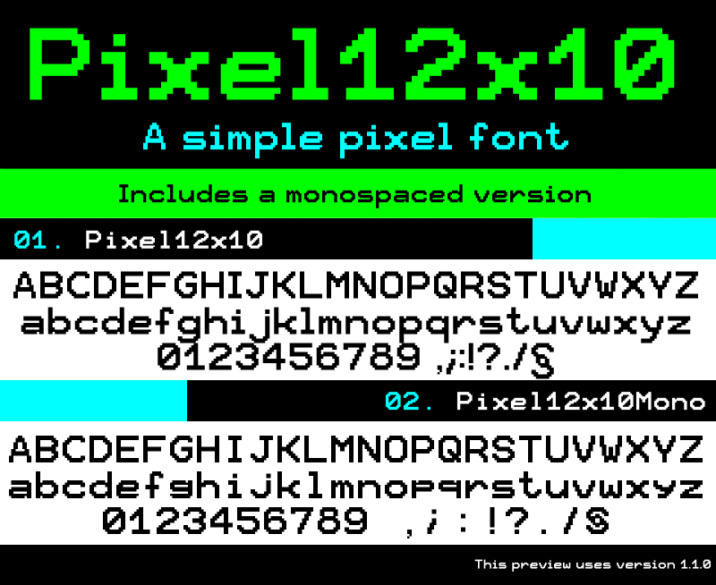

# Pixel12x10

A simple 12x10 pixel font.

The first font I've ever created back in March 2019, using [Bitfontmaker2](https://www.pentacom.jp/pentacom/bitfontmaker2/), then some bugs has been fixed using [Fontforge](https://fontforge.org/en-US/). *(small note: Bitfontmaker2 can't generate source files, it can only export fonts, that's why Fontforge is used)*

There are currently **198** glyphs supported.

## Build the fonts

You need to have [Fontforge](https://fontforge.org/en-US/) installed.

Then open the `.sfd` file of the font you want to export with it, and in the top left menu, *File* -> *Generate fonts* and set the file type to *'truetype'* (*otf* isn't supported for now)

## License
This font is under the [SIL Open Font License, Version 1.1](https://scripts.sil.org/OFL).